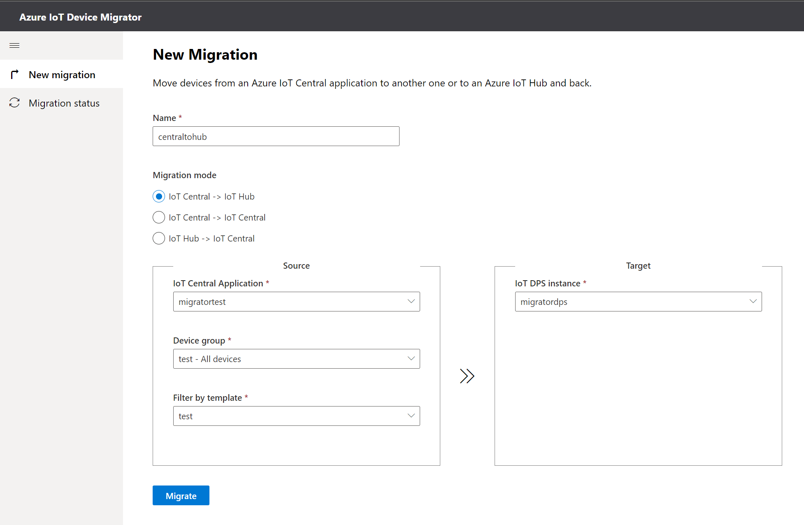
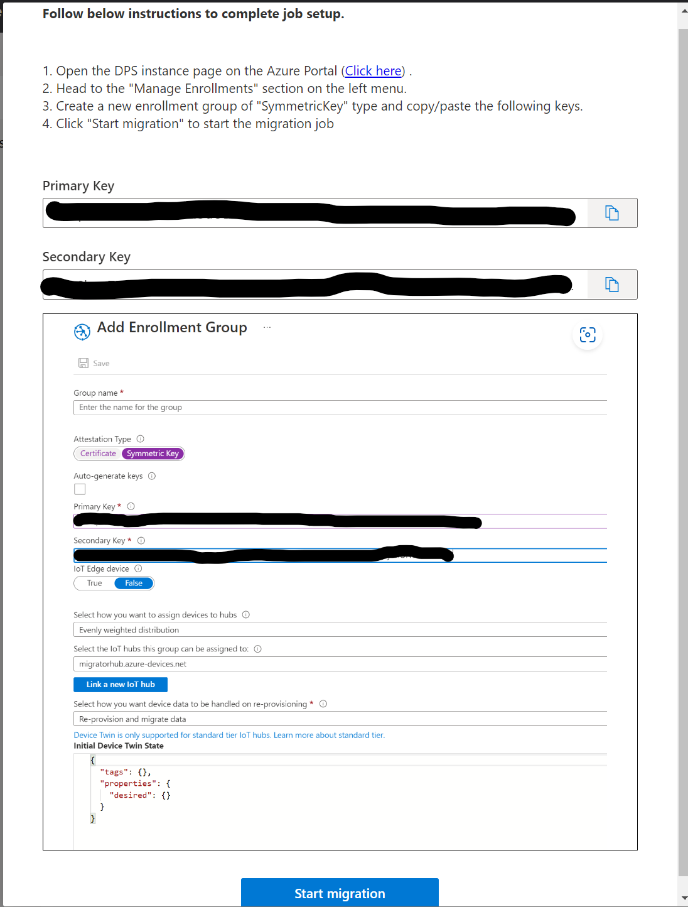
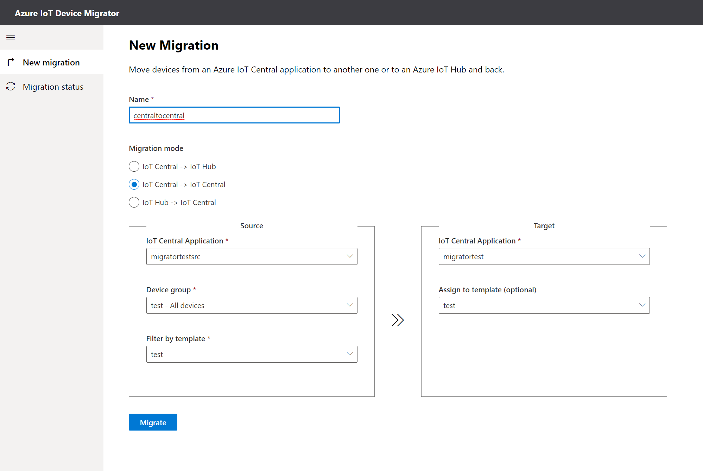
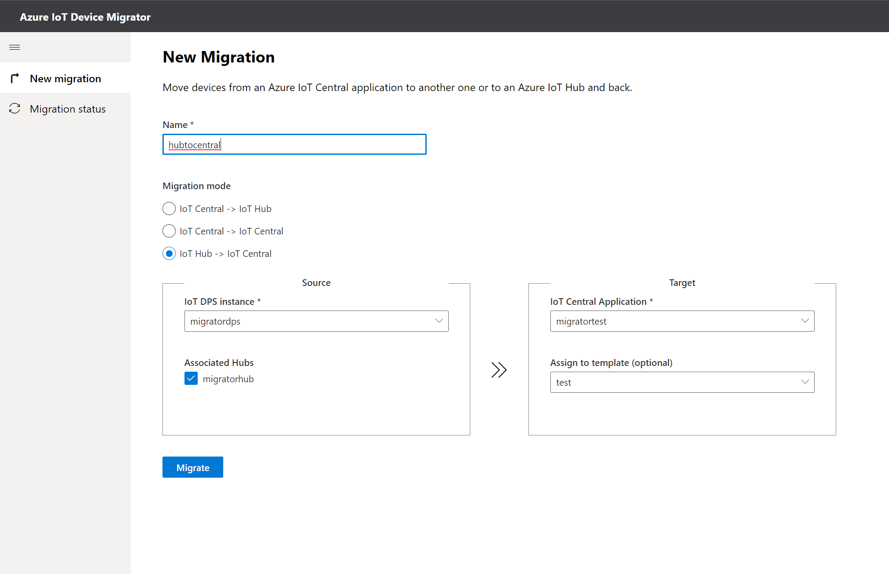
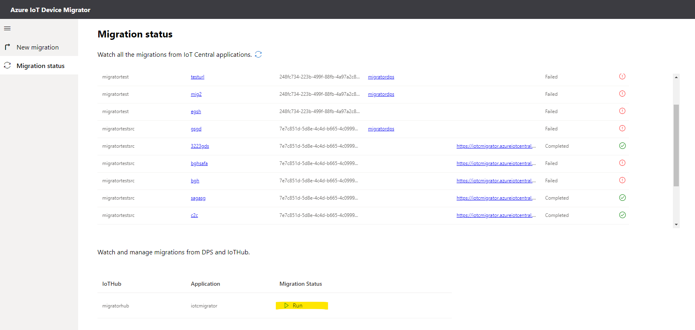
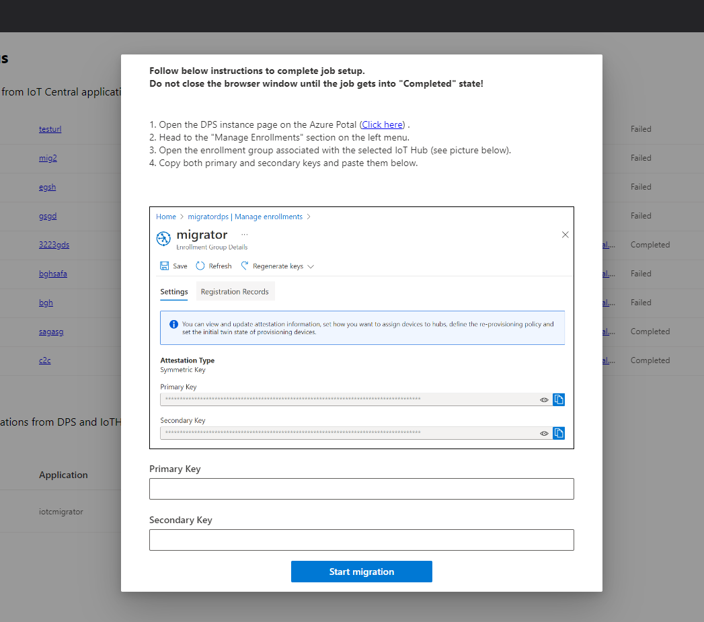

# Azure IoT Central device migration tool
A companion experience that enables you to move devices between IoT Central applications and from/to Azure IoT Hub.

## Requirements
- An IoT Central application (or two if moving between applications)
    > Go to [IoT Central](https://apps.azureiotcentral.com/home) to create one.
- An Azure Active Directory Application (AAD)
    > Follow instructions [here](./docs/appregistration.md).
- An IoT Hub instance (if migrating from/to Azure IoT Hub)
    > Go to [Azure Portal > IoT Hub](https://portal.azure.com/#create/Microsoft.IotHub) to create one IoT Hub.
- An Azure IoT Hub Device Provisioning Services (DPS) associated to the IoT Hub instance.
    > Go to [Azure Portal > DPS](https://portal.azure.com/#create/Microsoft.IoTDeviceProvisioning) to create one DPS.

## Setup
Create a file called _.env_ in project root with following content after completed AAD creation steps above.

```ini
PORT=3002
REACT_APP_AAD_APP_CLIENT_ID=<your-AAD-Application-(client)-ID>
REACT_APP_AAD_APP_TENANT_ID=<your-AAD-Directory-(tenant)-ID>
REACT_APP_AAD_APP_REDIRECT_URI=http://localhost:3002
```

> Make sure that the REACT_APP_AAD_APP_REDIRECT_URI in the config file and the Redirect URIs specified in your AAD Application are the same.

### Model requirements
To successfully perform a migration from an IoT Central application, the template for the devices to be migrated must comply to a specific configuration. The easiest and quickest way to define required capabilities is to import the _DeviceMigration_ component into the template.

You can find the json file [here](./assets/deviceMigrationComponent.json). 

Follow instructions on [IoT Central official documentation](https://docs.microsoft.com/en-us/azure/iot-central/core/howto-set-up-template#interfaces-and-components).

## Run
You can run the tool in development mode using:
```sh
npm start
```
- Open in the browser the AADRedirectURI url previously defined in your _.env_ (by default is http://localhost:3002) to view it in the browser.

- Authenticate the user.


### Options
1. __IoT Central -> IoT Hub__

Pick the needed values from source and target forms. Provide a name and click on _Migrate_ button.

Follow instructions on the page to create a new enrollment group in the DPS instance then click on _Start migration_.




2. __IoT Central -> IoT Central__

Pick the needed values from source and target forms. 
Optionally specify a target template to automatically assign migrating devices to a particular template in the application.
Provide a name and click on _Migrate_ button. 
Wait for the migration job to be configured. After that the job will automatically start and you can follow the progress in the _Migration status_ page.



3. __IoT Hub -> IoT Central__


Select the hubs from which migrating devices, provide a name and click on _Migrate_ button. The job has been configured and available in the _Migration status_ page. Once there click on "Run" and provide the required keys following instructions.





Wait for the job to complete.


### Codebase
_iotc-migrator_ is a React SPA application written in Typescript that runs 100% in the browser. It was bootstrapped with Create React App.

The project consume public Azure APIs on the latest stable versions.

The Authentication is performed using Microsoft Authentication Library (MSAL).

